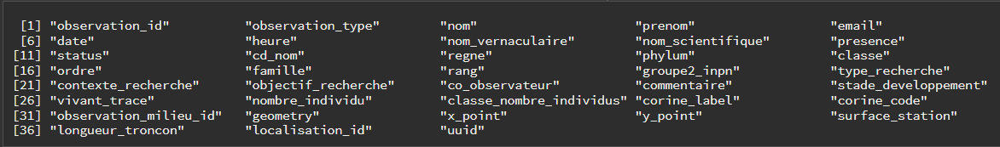
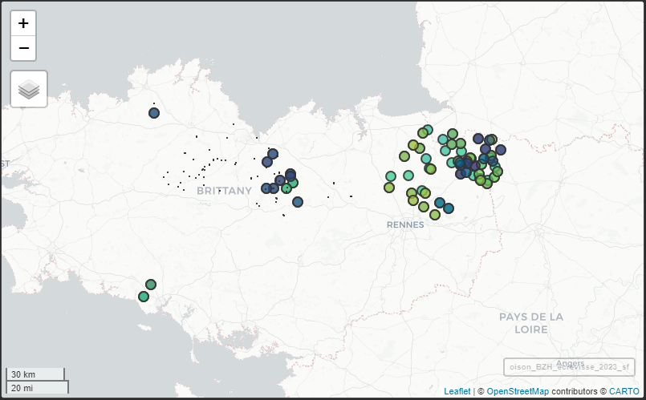

```{r, include = FALSE}
knitr::opts_chunk$set(
  collapse = TRUE,
  comment = "#>"
)
```

## Récupérer les données via l'accès à la base SQL

### Chargement des packages

Quelques packages sont nécessaires pour exécuter les exemples ci-dessous.

```{r setup, message=FALSE, warning=FALSE}
library(oisonR)
library(sf)
library(dplyr)
# devtools::install_github("MaelTheuliere/COGiter")
library(COGiter)
```

### Les observations taxons

Les *observations taxons* de [OISON](https://oison.ofb.fr/) sont récupérables avec la fonction `get_table_taxon_sql()`. Avant son utilisation, il faut toutefois : 

  - s'assurer de disposer des paramètres de connexion à la base SQL (*cf*. la vignette `oisonR` pour plus de détails) ;
  - puis, initier la connexion à la base de données avec la fonction `start_sql_connexion()`.

La fonction permet de récupérer l'ensemble des observations de la base, sauf si une géométrie est précisée en argument (argument `geometrie` dans la fonction).

Après récupération des données, il est conseillé de stopper la connexion à la base avec la fonction `stop_sql_connexion()`.

### Exemple pour réaliser un export des observations taxons sur les écrevisses en Bretagne pour l'année 2023

#### 1. Création d'une géométrie pour la Bretagne

Le package `COGiter` peut être utilisé pour récupérer la géométrie correspondant à la région, et la convertir en chaîne de caractères pour effectuer la requête.

```{r}
geom_BZH <-
  COGiter::regions_geo %>%
  # filtre sur BZH
  dplyr::filter(REG == 53) %>%
  sf::st_as_sfc() %>%
  # convert to text
  sf::st_as_text()
```

```{r, echo = FALSE}
string_geom_exemple <- paste0(substr(geom_BZH,1,100), '....')
```

Le début de la géométrie prend la forme suivante : 
`r string_geom_exemple`. 

#### 2. Récupération des données *observations taxons*

```{r, eval=FALSE, message=FALSE, warning=FALSE}
# a) connexion
bdd_oison <- start_sql_connexion()

# b) requete
oison_BZH <- 
  get_table_taxon_sql(conn = bdd_oison,
                      geometrie = geom_BZH)

# d) stop de la connexion
stop_sql_connexion(conn = bdd_oison)
```

Le résultat de la requête est un objet de type `data.frame`. Les noms de colonnes peuvent être obtenus de la façon suivante :

```{r, eval=FALSE}
oison_BZH %>% 
  names()
```

```{r varnames, echo=FALSE, out.width="200%"}

```

> ⚠️ A noter qu'ici les champs de données peuvent être différents de ceux présents dans les exports de l'application OISON* (*i.e* *champs manquants). Une vue simplifiée et facilement utilisable a été priviligée ! 

####  3. Filtrage des données

Pour extraire les observations taxons correspondant aux écrevisses observées en 2023, il suffit de réaliser un filtrage à partir (i) de la colonne `nom_vernaculaire` et (ii) de la nouvelle colonne `annee` (créée à partir de la colonne `date`) :

```{r, eval=FALSE}
oison_BZH_ecrevisse_2023 <-
  oison_BZH %>% 
  # detection pattern 'creviss' et filtre
  dplyr::filter(grepl('creviss', nom_vernaculaire)) %>% 
  # création colonne annee
  dplyr::mutate(annee = format(date, '%Y')) %>% 
  # filtre sur annee 2023
  dplyr::filter(annee == 2023)
```

#### 4. Visualisation des données
  
Pour une réutilisation en analyse spatiale, la colonne `geometry` doit être convertie au format `sf` (*simple features*) avec la fonction `st_as_sf()` du package `sf`.

```{r, eval=FALSE}
oison_BZH_ecrevisse_2023_sf <-
  oison_BZH_ecrevisse_2023 %>% 
  sf::st_as_sf()
```

Avec cet objet, les visualisations interactives sont possibles (*à noter qu'il ne s'agit pas des vraies données dans l'exemple ci-dessous...* 🕶) avec le package `mapview` :

```{r, eval=FALSE, fig.width=4, fig.height=4}
oison_BZH_ecrevisse_2023_sf %>% 
  mapview::mapview()
```

```{r exemple_mapview, echo=FALSE, out.width="200%"}

```

```{r, echo=FALSE}
# oison_BZH_ecrevisse_2023 <-
#   oison_BZH %>% 
#   # detect pattern 'creviss' and filter
#   dplyr::filter(grepl('creviss', nom_vernaculaire)) %>% 
#   dplyr::mutate(annee = format(date, '%Y')) %>% 
#   dplyr::filter(annee == 2023)
# 
# oison_BZH_ecrevisse_2023_sf <-
#   oison_BZH_ecrevisse_2023 %>% 
#   sf::st_as_sf() %>% 
#   dplyr::mutate(row = paste('id',row_number())) %>% 
#   dplyr::select(row) %>% 
#   sf::st_jitter(factor = .05)
# 
# mapview::mapview(oison_BZH_ecrevisse_2023_sf, legend = FALSE)
```

#### 5. Export des données

L'export sous différents formats est possible, dont le format *geopackage* `.gpkg` pour une réutilisation sous SIG.

> 💡 Le format `gpkg` permet de conserver dans le même objet les différents types de géométries pouvant se retrouver dans OISON (points, polygones, lignes, ...).

```{r, eval=FALSE}
sf::write_sf(oison_BZH_ecrevisse_2023_sf, 
             "D:/oison_BZH_ecrevisse_2023.gpkg", 
             driver = "GPKG")
```

### Les observations milieu

TO COMPLETE... 🛠


## Récupérer les données via l'API

TO COMPLETE... 🛠
